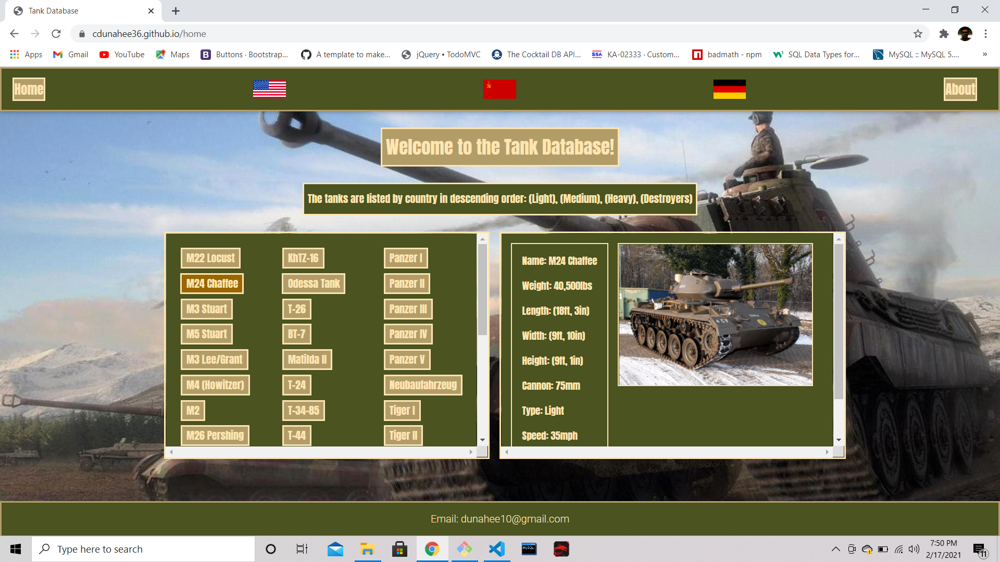
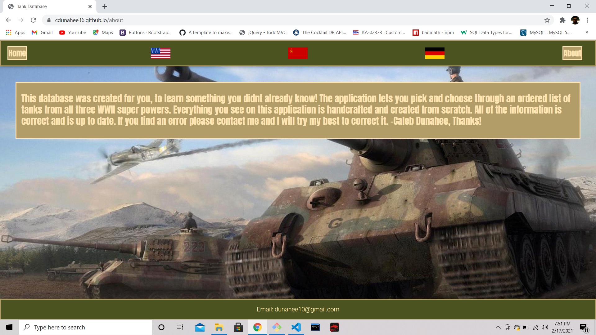
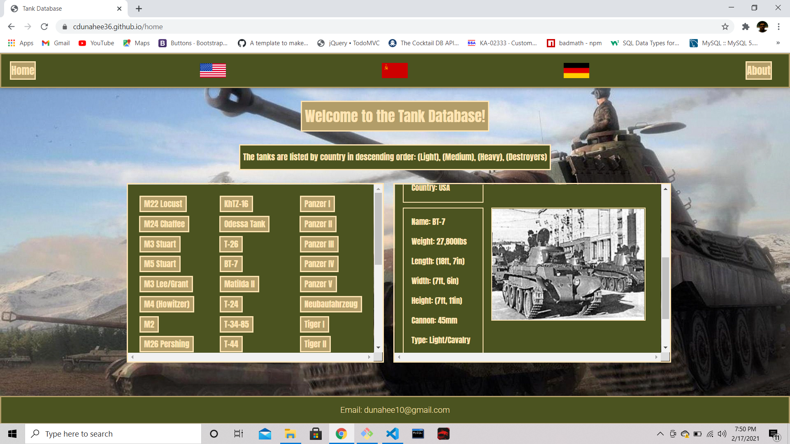

# Tank-Database

# Live app link
https://cdunahee36.github.io/tankdb/

## Description

* This application allows a user to view a database of 
the main army tanks from the top three world super powers
during WWII. When a user clicks on a tanks name, the tank
will have its data displayed as well as a picture of the 
tank.

# License 

* MIT

# Screenshots

